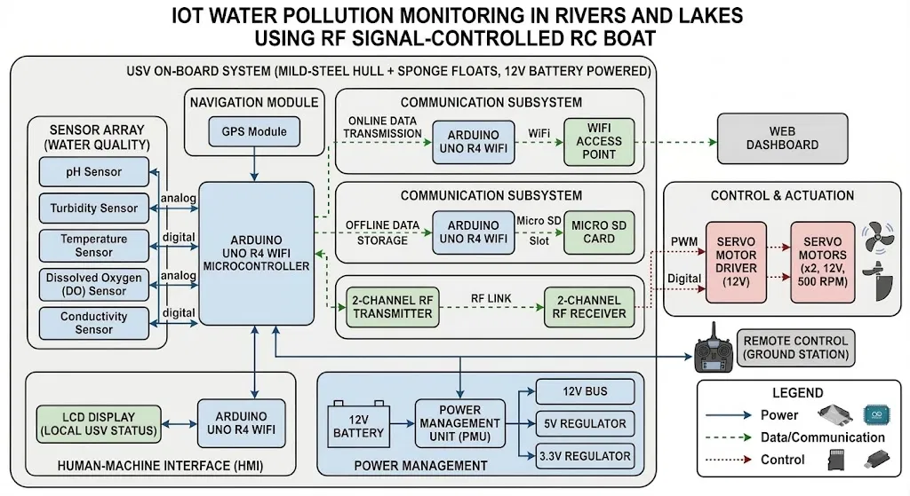
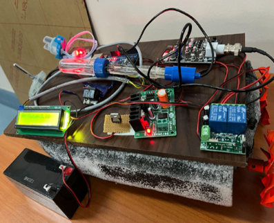

# Architecture

The system is organized as one physical unit — the **Unmanned Surface Vehicle (USV)** — built on a mild-steel hull with sponge floats and powered by a 12V battery, plus an external **Remote Control (Ground Station)** operated from shore. The onboard system is split into five functional subsystems, all coordinated through a central Arduino UNO R4 WiFi microcontroller.

## Components List

| # | Component | Type / Spec | Function |
|---|---|---|---|
| 1 | pH Sensor | Analog | Measures acidity/alkalinity of the water |
| 2 | Turbidity Sensor | Analog | Measures water clarity (NTU) |
| 3 | Temperature Sensor | Digital | Measures water temperature |
| 4 | Dissolved Oxygen (DO) Sensor | Analog | Measures oxygen available for aquatic life |
| 5 | Conductivity Sensor | Digital | Measures dissolved-ion concentration in water |
| 6 | GPS Module | Navigation | Supplies live coordinates to geo-tag each reading |
| 7 | Arduino UNO R4 WiFi (Central Microcontroller) | Main MCU | Reads all sensors, coordinates GPS, routes data to all subsystems |
| 8 | Arduino UNO R4 WiFi (Online Transmission) | Comms MCU | Sends processed readings over Wi-Fi |
| 9 | Wi-Fi Access Point | Networking | Relays readings from the boat to the Web Dashboard |
| 10 | Web Dashboard | Software | Real-time remote monitoring interface |
| 11 | Arduino UNO R4 WiFi (Offline Storage) | Comms MCU | Writes readings to the Micro SD card |
| 12 | Micro SD Card + Slot | Storage | Offline data logging when no network is available |
| 13 | 2-Channel RF Transmitter | RF, 2-channel | Sends/receives control signals over the RF link |
| 14 | 2-Channel RF Receiver | RF, 2-channel | Receives movement commands on the boat |
| 15 | Servo Motor Driver | 12V | Converts PWM signal into motor drive current |
| 16 | Servo Motors | x2, 12V, 500 RPM | Drive the propeller shaft and rudder |
| 17 | Remote Control (Ground Station) | Handheld unit | Operator's controller for steering the boat |
| 18 | LCD Display | Local display | Shows live USV status on the boat itself |
| 19 | Arduino UNO R4 WiFi (HMI) | Display MCU | Drives the on-board LCD display |
| 20 | 12V Battery | Power source | Powers the entire onboard system |
| 21 | Power Management Unit (PMU) | Power regulation | Distributes 12V / 5V / 3.3V rails to all subsystems |
| 22 | Mild-Steel Hull + Sponge Floats | Structure | Boat body — buoyancy and low water resistance |

## Architecture Description

1. **Sensor Array (Water Quality)** — Five sensors continuously sample the water: pH, turbidity, and dissolved oxygen (DO) send analog signals, while temperature and conductivity send digital signals. All five feed directly into the central Arduino UNO R4 WiFi.

2. **Navigation Module** — A GPS module supplies live location coordinates, which are picked up by the communication subsystem so that every reading can be geo-tagged.

3. **Central Microcontroller** — The Arduino UNO R4 WiFi at the core of the on-board system reads all sensor data, coordinates with the GPS module, and pushes processed readings out to three parallel destinations: the online transmission path, the offline storage path, and the RF control path — plus a fourth path to the on-board display.

4. **Communication Subsystem** — split into three independent channels so the system keeps working whether or not internet access is available:
   - **Online Data Transmission:** A dedicated Arduino UNO R4 WiFi sends readings over Wi-Fi to a Wi-Fi Access Point, which forwards them to a Web Dashboard for real-time remote viewing.
   - **Offline Data Storage:** A second Arduino UNO R4 WiFi writes the same readings to a Micro SD Card via a Micro SD slot, so nothing is lost when there's no network coverage.
   - **RF Control Link:** A 2-channel RF Transmitter and 2-channel RF Receiver form the wireless command link between the boat and the operator, independent of Wi-Fi.

5. **Control & Actuation** — Commands received over the RF link are converted to a PWM signal, sent to a Servo Motor Driver (12V), which then drives two servo motors (12V, 500 RPM) via a digital signal. These motors turn the propeller shaft and rudder, giving the boat forward/reverse motion and steering.

6. **Remote Control (Ground Station)** — The handheld controller held by the operator sends steering commands (Control link) into the RF stage, which is then relayed to the Control & Actuation subsystem — this is how the operator drives the boat from shore.

7. **Human-Machine Interface (HMI)** — A separate LCD Display, driven by its own Arduino UNO R4 WiFi, shows the USV's local status (readings, boat state) directly on the vehicle itself — useful for anyone standing near the boat without needing the web dashboard.

8. **Power Management** — A single 12V battery feeds a Power Management Unit (PMU), which distributes regulated power across a 12V bus, a 5V regulator, and a 3.3V regulator — supplying every subsystem (sensors, microcontrollers, RF modules, servos) at the voltage it needs.

**Legend:** Blue solid = Power · Green dashed = Data/Communication · Red dotted = Control

## Data Flow (Step-by-Step)

1. **Power-up** — The 12V battery powers the PMU, which regulates and distributes power (12V/5V/3.3V) to every onboard subsystem.

2. **Sensing** — The five water-quality sensors continuously measure pH, turbidity, temperature, DO, and conductivity, sending analog or digital signals to the central Arduino UNO R4 WiFi.

3. **Positioning** — The GPS module supplies the boat's current coordinates, so every batch of readings can be tied to a specific location.

4. **Processing** — The central microcontroller compiles the sensor values with the GPS/time data into a single reading packet.

5. **Online path** — If Wi-Fi is available, the packet is passed to the online-transmission Arduino, sent via Wi-Fi to the Access Point, and forwarded to the Web Dashboard for live remote monitoring.

6. **Offline path** — In parallel, the same packet is always written to the Micro SD card through the offline-storage Arduino, guaranteeing the data survives even with zero connectivity — once back in range, the stored logs can be uploaded or reviewed.

7. **Local display path** — The same reading is also sent to the HMI Arduino, which updates the on-board LCD so the current water-quality status is visible directly on the boat.

8. **Control loop** — Meanwhile, the operator at the ground station sends steering input through the RF transmitter, over the RF link, to the on-board 2-channel RF receiver.

9. **Actuation** — The RF receiver's output is converted to PWM, driven through the 12V servo motor driver, and sent as a digital signal to the two servo motors, which move the propeller shaft and rudder to steer and propel the boat.

10. **Continuous cycle** — Steps 2–9 repeat throughout deployment, so the boat is simultaneously collecting geo-tagged water-quality data (with redundant online + offline storage) while being actively piloted from shore.

    

